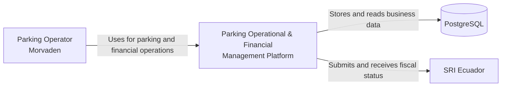
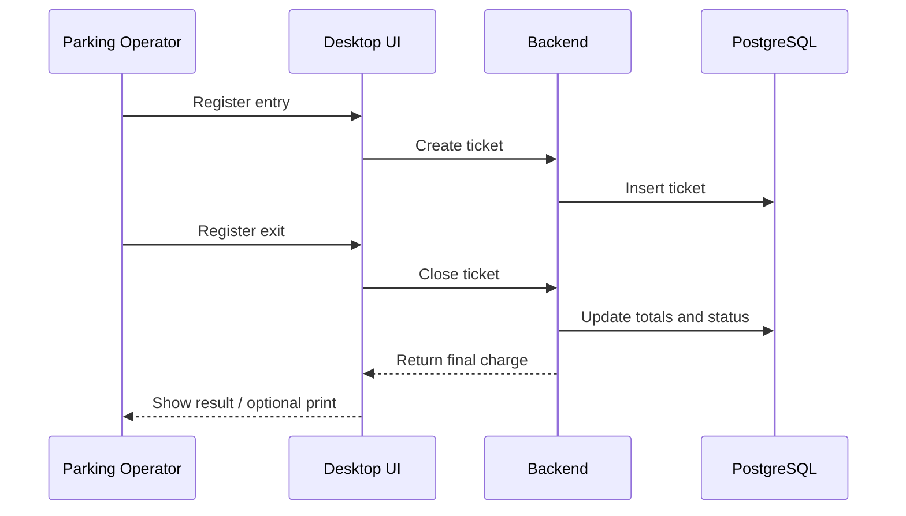
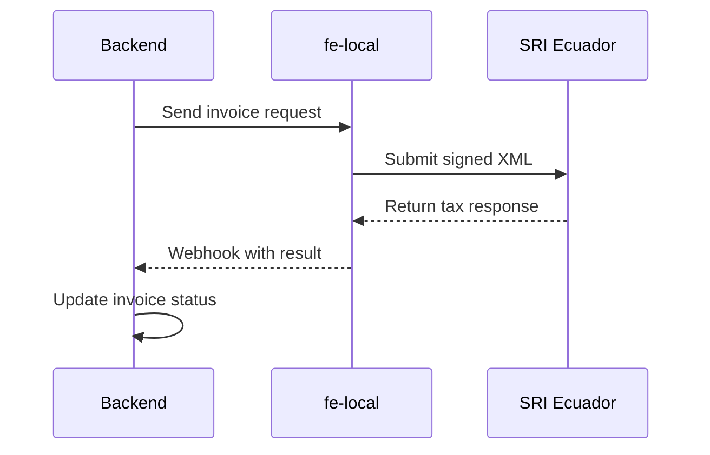

# Architecture

## 1. System Context (C4 Context)

The Parking Operational & Financial Management Platform supports the daily operation of a real-world parking business operated by Morvaden. It centralizes operational control, cash and close processes, and financial records in a desktop-first system. Electronic invoicing is handled through a dedicated fiscal service that integrates with SRI Ecuador. PostgreSQL is the persistence layer for core business data. This repository contains documentation only; application code is private.



## 2. Containers (C4 Container)

The platform is split into a desktop client, an operational backend, a separate electronic invoicing service, and a shared database. This container split keeps operational workflows in the backend while isolating fiscal logic in `fe-local`.

```mermaid
flowchart TD
    UI[Jetpack Compose Desktop UI]
    BE[Spring Boot Backend<br/>(Modular Monolith)]
    FE[fe-local<br/>(Electronic Invoicing Microservice)]
    DB[(PostgreSQL)]
    SRI[SRI Ecuador]

    UI -->|REST| BE
    BE -->|JDBC| DB
    BE -->|HTTP internal| FE
    FE -->|Tax API| SRI
    FE -->|Webhook| BE
```

## 3. Responsibilities & Boundaries

**Jetpack Compose Desktop UI**

- Provides the operator-facing desktop interface for parking and financial tasks.
- Uses a Ktor HTTP client to consume backend REST endpoints.
- Displays operational state, close results, and invoice status to users.

**Spring Boot Backend (Modular Monolith)**

- Owns the core operational and financial business logic.
- Exposes REST APIs used by the desktop application.
- Persists business data in PostgreSQL through JDBC.
- Orchestrates electronic invoicing requests to `fe-local`.
- Receives webhook callbacks from `fe-local` and updates platform state.

**fe-local (Electronic Invoicing Microservice)**

- Owns fiscal logic and tax-compliance processing.
- Generates and validates XML for SRI v2.1.0.
- Signs documents with PKCS#12 certificates.
- Sends fiscal documents to SRI and returns results through webhook callbacks.
- Generates RIDE PDFs as part of the invoicing flow.

**PostgreSQL**

- Stores the backend's operational and financial records.
- Serves as the primary transactional datastore for the platform.

**SRI Ecuador**

- Acts as the external tax authority system.
- Receives electronic fiscal documents from `fe-local`.
- Returns acceptance, rejection, or processing responses.

The primary boundary is between operational logic in the backend and fiscal logic in `fe-local`. Parking operations, cash control, and business rules remain in the backend, while tax document generation, signing, validation, and SRI integration remain isolated in the invoicing service.

## 4. Key Backend Modules (Operational/Financial Domain)

- Tickets
- CashShift (Daily Close)
- Weekly Close
- Monthly Close
- Expenses
- Users & Permissions (Permission Matrix)
- Audit
- Electronic Sync/Orchestration with `fe-local`

## 5. Key Flows

### A) Ticket lifecycle (Entry -> Exit -> optional print)



### B) Electronic invoice flow (Backend -> fe-local -> SRI -> fe-local -> Webhook -> Backend)



## 6. Security Architecture

- `fe-local` uses AES-256-GCM to protect certificate credential storage and handling.
- Fiscal document signing is performed with PKCS#12 certificates.
- XML payloads for SRI v2.1.0 are validated against XSD before submission.
- Audit logging supports traceability for operational actions and fiscal events.
- Fiscal processing is isolated from operational logic by keeping tax workflows inside `fe-local`.

## 7. Multitenancy Model

- The backend is single-tenant and does not maintain tenant context.
- `fe-local` supports tenant selection by configuration or domain.
- Tenant selection happens inside `fe-local`, based on its own runtime configuration.
- No backend tenant context is propagated to `fe-local` in the current design.

## 8. Deployment & Environments

- The current production deployment is on-premise and runs as Windows Service infrastructure.
- Configuration is environment-based so endpoints, credentials, and operational settings can vary by environment.
- Flyway migrations exist in both the backend and `fe-local` to manage schema evolution.
- A VPS migration is planned as a future deployment step, and the current architecture is compatible with that direction.
- The system is not currently deployed on a VPS.

## 9. Future Improvements (Realistic)

- Add backend multitenancy, including tenant context propagation where needed.
- Improve observability with metrics, tracing, and clearer operational diagnostics.
- Introduce an optional queue for invoicing requests if load increases.
- Add containerization to standardize future VPS deployments.
- Harden backup and monitoring practices.
